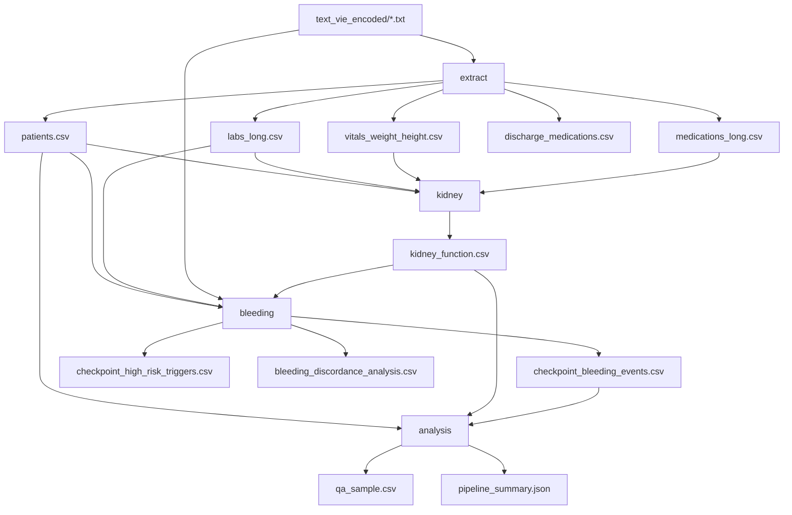

# DOAC Kidney Function and Bleeding Event Pipeline

Extract structured clinical data from Vietnamese hospital admission text files, compute **eCrCL** (Cockcroft–Gault) vs **de-indexed eGFR** (CKD-EPI 2009) with **EHRA 2021 DOAC dose rules**, and detect **bleeding events** and **paraclinical high-risk triggers**.

---

## Overview

This pipeline processes de-identified admission charts (`text_vie_encoded/*.txt`) and produces analysis-ready CSV/JSON tables under `data/export/` and `data/checkpoints/`.

| Stage | Purpose |
|-------|---------|
| **Extract** | Patient metadata, labs, vitals, medications |
| **Kidney** | eCrCL, eGFR, EHRA dose recommendations, dose discordance |
| **Bleeding** | Clinical bleeding NLP, lab/DOAC-stop triggers, cohort analysis |
| **Analysis** | Stratified QA sample and pipeline-wide summary |

---

## Project structure

```
Finding bleeding events/
├── text_vie_encoded/          # Input: one .txt file per admission
├── data/
│   ├── export/                # Primary analysis tables (CSV)
│   ├── checkpoints/           # QA, filters, samples, summaries (CSV/JSON)
│   └── config/                # Editable drug-interaction lists (CSV)
├── src/
│   ├── run_pipeline.py        # CLI entrypoint
│   ├── config.py              # Paths, thresholds, DOAC rules, keywords
│   ├── parse_text.py          # Text normalization and section splitting
│   ├── extract_metadata.py    # Patient demographics and exclusions
│   ├── extract_labs.py        # Laboratory results (long format)
│   ├── extract_vitals.py      # Weight and height
│   ├── extract_medications.py # Inpatient + discharge medications
│   ├── kidney_function.py     # eCrCL/eGFR and dose logic
│   ├── bleeding_detect.py     # Bleeding events and triggers
│   ├── pipeline_qa.py         # QA sample and pipeline summary
│   └── deidentify_text.py     # Optional PII scrubbing utility
├── tests/
│   └── test_bleeding_classify.py
├── notebooks/
│   └── workflow_check.ipynb   # Sanity-check outputs without full CLI run
└── requirements.txt
```

---

## Setup

```bash
python -m venv .venv
source .venv/bin/activate   # Windows: .venv\Scripts\activate
pip install -r requirements.txt
```

**Dependencies:** `pandas>=2.0`, `python-dateutil>=2.8`

---

## Pipeline workflow



### Step 1 — Extract (`--step extract`)

Reads every `*.txt` in the input directory and writes structured tables.

1. **Patient metadata** — IDs, age, sex, admission/discharge dates, DOAC drug, exclusion flags.
2. **Labs** — Creatinine, Hgb, Hct, PLT, PT/INR, APTT, eGFR from lab report blocks.
3. **Vitals** — Weight (kg) and height (cm) from inline pairs or standalone mentions.
4. **Medications** — Inpatient order forms (`phiếu thực hiện y lệnh`, `hiện y lệnh`) and discharge prescriptions (`đơn thuốc`), with CYP3A4/P-gp inhibitor flags.

### Step 2 — Kidney (`--step kidney`)

Joins creatinine labs with nearest weight/height, admission medications, and inhibitor flags. For each creatinine row:

- **eCrCL** — Cockcroft–Gault (mL/min, unadjusted)
- **eGFR indexed** — CKD-EPI 2009 (mL/min/1.73 m²), from lab or recalculated
- **eGFR absolute** — De-indexed: `eGFR × BSA / 1.73`
- **EHRA 2021 recommended dose** — Separate tracks for eCrCL and de-indexed eGFR
- **Dose mismatch** — Prescribed DOAC dose vs each recommendation track
- **Discordance** — eCrCL and eGFR tracks recommend different EHRA doses

Prophylaxis (rivaroxaban 10 mg) and PAD (2.5 mg) doses are flagged and excluded from the main export.

### Step 3 — Bleeding (`--step bleeding`)

Per admission:

- **Lab triggers** — INR > 5, APTT > 100 s, Hgb/Hct drop ≥ 25% between consecutive results
- **DOAC stop triggers** — Stop/hold language (`ngừng`, `dừng`, `tạm dừng`, …) near DOAC names in order forms
- **Clinical bleeding** — Keyword search in `tờ điều trị` sections with negation, history, and procedure-context filters

Builds admission-level **discordance analysis** linking bleeding/triggers to kidney metrics and dose recommendations.

### Step 4 — Analysis (`--step analysis`)

- Stratified **QA sample** (~30 rows) for manual review
- **Pipeline summary** JSON aggregating counts across all stages

---

## Running the pipeline

From the project root:

```bash
# Full pipeline (default)
python -m src.run_pipeline

# Individual steps
python -m src.run_pipeline --step extract
python -m src.run_pipeline --step kidney
python -m src.run_pipeline --step bleeding
python -m src.run_pipeline --step analysis

# Custom input directory
python -m src.run_pipeline --text-dir /path/to/texts
```

### Run modules directly

```bash
python -m src.extract_metadata
python -m src.extract_labs
python -m src.extract_vitals
python -m src.extract_medications
python -m src.kidney_function
python -m src.bleeding_detect
python -m src.pipeline_qa
python -m src.deidentify_text    # optional PII scrubbing
```

### Tests

```bash
python -m pytest tests/
```

---

## Input format

- **Location:** `text_vie_encoded/` (override with `--text-dir`)
- **Encoding:** UTF-8; one file per admission
- **Expected header (lines 1–4):** `mã bn`, `mã đt`, 10-digit patient ID, 12-digit encounter record. Non-standard headers fall back to regex parsing (`config.RE_PATIENT_ID`, `config.RE_PATIENT_RECORD`).
- **Sections used:**
  - Lab reports — `phiếu báo cáo kết quả xét nghiệm` / `phiếu kết quả xét nghiệm`
  - Clinical notes — `tờ điều trị` (bleeding search)
  - Medications — `phiếu thực hiện y lệnh`, `hiện y lệnh`, `đơn thuốc`

---

## Outputs

### Export tables (`data/export/`)

| File | Description |
|------|-------------|
| `patients.csv` | One row per admission: IDs, demographics, DOAC, exclusion |
| `labs_long.csv` | Long-format labs: creatinine, Hgb, Hct, PLT, PT/INR, APTT, eGFR |
| `vitals_weight_height.csv` | Weight/height measurements with source context |
| `medications_long.csv` | Inpatient medication orders (all drugs) |
| `discharge_medications.csv` | Discharge prescription items |
| `kidney_function.csv` | Per-creatinine kidney metrics and dose recommendations |
| `bleeding_discordance_analysis.csv` | Admission-level bleeding + triggers + kidney/dose fields |

### Checkpoints (`data/checkpoints/`)

| File | Description |
|------|-------------|
| `checkpoint_excluded_age_or_pregnancy.csv` | Excluded admissions (age < 18, pregnancy) |
| `checkpoint_missing_weight_height.csv` | Records without a valid weight/height pair |
| `checkpoint_high_risk_triggers.csv` | Lab and DOAC-stop trigger events |
| `checkpoint_bleeding_events.csv` | All bleeding keyword hits with classification |
| `checkpoint_doac_stop_samples.csv` | Sample contexts for DOAC stop events |
| `checkpoint_medication_frequency.json` | Drug frequency counts |
| `checkpoint_discharge_filtered.json` | Discharge items filtered as supplies/IV fluids |
| `checkpoint_kidney_function_filters.json` | Cohort filter statistics |
| `checkpoint_dose_discordance.csv` | Dose mismatch detail by metric track |
| `checkpoint_dose_discordance.json` | Dose discordance summary |
| `checkpoint_bleeding_cohort_summary.json` | Bleeding/trigger cohort statistics |
| `qa_sample.csv` | Stratified manual-review sample |
| `pipeline_summary.json` | End-to-end pipeline counts |

### Config (`data/config/`)

| File | Description |
|------|-------------|
| `cyp3a4_inhibitors.csv` | CYP3A4 inhibitors: `generic,alias` columns |
| `pgp_inhibitors.csv` | P-gp inhibitors: `generic,alias` columns |

---

## Module reference

### `src/run_pipeline.py` — CLI orchestration

| Function | Description |
|----------|-------------|
| `ensure_directories()` | Create `data/export`, `data/checkpoints`, `data/config` |
| `run_extract(text_dir)` | Run all four extraction modules |
| `run_kidney()` | Compute kidney function and dose rules |
| `run_bleeding(text_dir)` | Detect bleeding and triggers |
| `run_analysis(text_dir)` | Generate QA sample and summary |
| `run_all(text_dir)` | Full pipeline in order |
| `main(argv)` | argparse CLI: `--step`, `--text-dir` |

### `src/config.py` — Central configuration

Defines project paths, regex patterns, lab type aliases, DOAC brand/generic mappings, EHRA 2021 dose rules, exclusion patterns, bleeding keywords, paraclinical thresholds, and PDF artifact cleanup. Edit here (or inhibitor CSVs) to tune behavior without changing extraction logic.

**DOAC drugs:** edoxaban, apixaban, rivaroxaban, dabigatran

**EHRA reduction logic:**

| Drug | Standard → Reduced | Trigger logic |
|------|-------------------|---------------|
| Edoxaban | 60 → 30 mg QD | Any 1 of: weight ≤ 60 kg, eCrCL 15–49, P-gp inhibitor |
| Apixaban | 5 → 2.5 mg BID | Any 2 of: weight ≤ 60 kg, age ≥ 80, creatinine ≥ 133 µmol/L |
| Rivaroxaban | 20 → 15 mg QD | eCrCL 15–49 |
| Dabigatran | 150 → 110 mg BID | eCrCL 30–49 |

### `src/parse_text.py` — Text utilities

| Function | Description |
|----------|-------------|
| `normalize(text)` | Lowercase, strip PDF artifacts, collapse whitespace |
| `split_clinical_notes(text)` | Split into `tờ điều trị` sections |
| `split_lab_reports(text)` | Split into lab-report blocks |
| `parse_lab_date_return(block)` | Parse result approval date from a lab block |
| `parse_vietnamese_date_fragment(fragment)` | Parse Vietnamese date strings |

### `src/extract_metadata.py` — Patient demographics

| Function | Description |
|----------|-------------|
| `extract_patient_metadata(text_dir)` | **Main entry.** Parse all files → `patients.csv` + exclusion checkpoint |

**Output columns:** `source_file`, `patient_id`, `patient_record`, `age`, `sex`, `date_admission`, `date_discharge`, `doac_drug`, `excluded`, `exclusion_reason`, `pregnancy_details`

**Exclusions:** Age < 18 (`MIN_COHORT_AGE`); clinical pregnancy patterns (e.g. `thai N tuần`, IVF).

### `src/extract_labs.py` — Laboratory extraction

| Function | Description |
|----------|-------------|
| `extract_labs(text_dir)` | **Main entry.** Parse all files → `labs_long.csv` |

**Lab types:** `creatinine`, `hgb`, `hct`, `plt`, `pt_inr`, `pt_sec`, `aptt`, `egfr`

**Output columns:** `patient_record`, `lab_type`, `date_return`, `value`, `unit`, `reference_range`, `raw_test_name`, `source_file`

### `src/extract_vitals.py` — Weight and height

| Function | Description |
|----------|-------------|
| `extract_vitals(text_dir)` | **Main entry.** Parse all files → `vitals_weight_height.csv` + missing-WH checkpoint |

Detects inline pairs (`cân nặng: … kg chiều cao: … cm`), multiline pairs, and standalone values. Validates plausible ranges (25–250 kg, 100–230 cm) and flags inconsistent measurements within a record.

**Output columns:** `patient_record`, `date_measured`, `weight_kg`, `height_cm`, `source_context`, `source_file`

### `src/extract_medications.py` — Medication extraction

| Function | Description |
|----------|-------------|
| `extract_medications(text_dir)` | **Main entry.** Returns `(inpatient_df, discharge_df)`; writes CSVs and checkpoints |
| `_load_inhibitor_entries(csv_path)` | Load CYP3A4/P-gp inhibitor lists |
| `_parse_inpatient_medications(...)` | Parse order-form and hiện y lệnh blocks |
| `_parse_discharge_medications(...)` | Parse đơn thuốc blocks; filter supplies/IV fluids |
| `_compute_active_quantity(text)` | Net quantity after partial/full retrieval |
| `_resolve_generic_name(drug_raw)` | Map brand names to generic via parentheses |
| `_match_inhibitor(...)` | Flag CYP3A4/P-gp inhibitor co-medications |
| `_is_doac(...)` | Identify DOAC drugs |
| `_write_doac_stop_samples(...)` | Sample DOAC stop contexts for QA |
| `_write_medication_frequency_json(...)` | Drug frequency checkpoint |

**Output columns (both inpatient and discharge):** `patient_record`, `drug_raw`, `drug_generic`, `dose`, `route`, `date_ordered`, `date_active`, `qty_ordered`, `qty_active`, `unit`, `is_stopped`, `source_section`, `is_cyp3a4_inhibitor`, `is_pgp_inhibitor`, `source_file`

### `src/kidney_function.py` — Kidney metrics and dose rules

| Function | Description |
|----------|-------------|
| `bsa_du_bois(height_cm, weight_kg)` | Body surface area (Du Bois, m²) |
| `creatinine_umol_to_mg_dl(creatinine_umol_l)` | Unit conversion for formulas |
| `cockcroft_gault(...)` | eCrCL (mL/min, unadjusted) |
| `ckd_epi_2009(...)` | Indexed eGFR (CKD-EPI 2009) |
| `deindex_egfr(egfr_indexed, bsa_m2)` | Absolute eGFR (mL/min) |
| `recommended_dose(doac, ...)` | EHRA 2021 dose label for one metric track |
| `compute_kidney_function()` | **Main entry.** Join inputs → `kidney_function.csv` |

**Key output columns:** `ecrcl_cg_ml_min`, `egfr_2009_indexed`, `egfr_2009_absolute`, `ecrcl_recommended_dose`, `egfr_recommended_dose`, `doac_prescribed_dose`, `dose_mismatch_ecrcl`, `dose_mismatch_egfr`, `discordant`, `triple_therapy`, `has_pgp_inhibitor`, `has_cyp3a4_inhibitor`

Vitals are joined to each creatinine row using the nearest measurement on or before the lab date.

### `src/bleeding_detect.py` — Bleeding and triggers

| Function | Description |
|----------|-------------|
| `detect_bleeding_and_triggers(text_dir)` | **Main entry.** Full bleeding/trigger analysis and exports |
| `_detect_lab_triggers(labs_df)` | INR, APTT, Hgb/Hct drop triggers |
| `_detect_doac_stop_triggers(...)` | DOAC stop/hold language in order forms |
| `_detect_bleeding_events(...)` | Keyword search in clinical notes |
| `_classify_bleeding_hit(...)` | Classify hit as `bleeding_event`, `history_bleeding`, or `procedure` |
| `_should_skip_bleeding_match(...)` | Negation and exclude-context filters |
| `_build_discordance_analysis(...)` | Admission-level analysis table |
| `_build_dose_discordance_exports(...)` | Dose mismatch by eCrCL vs eGFR track |
| `_build_cohort_summary(...)` | Cohort statistics checkpoint |

**Bleeding keywords** (configurable at top of module): `chảy máu`, `xuất huyết`, `phân đen`, `ra máu`, `nôn máu`, `tiểu máu`, etc.

**Bleeding event columns:** `patient_record`, `source_file`, `date_encounter`, `trigger_type`, `source_context`, `event_class`, `history_reason`

**Trigger types:** `inr_gt_5`, `aptt_gt_100`, `hgb_drop_ge_25pct`, `hct_drop_ge_25pct`, `doac_stop`

### `src/pipeline_qa.py` — QA and summary

| Function | Description |
|----------|-------------|
| `find_non_standard_header_files(text_dir)` | List files needing regex ID fallback |
| `generate_qa_sample(text_dir)` | Stratified sample → `qa_sample.csv` |
| `generate_pipeline_summary(text_dir)` | Aggregate counts → `pipeline_summary.json` |
| `run_qa(text_dir)` | **Main entry.** Run both QA functions |

**QA categories:** `egfr_mismatch`, `bleeding_positive`, `excluded`, `missing_vitals`, `non_standard_header`

### `src/deidentify_text.py` — Optional PII scrubbing

Standalone utility (not part of the main pipeline). Replaces names, IDs, phone numbers, and addresses in text files.

| Function | Description |
|----------|-------------|
| `deidentify_text(text, patterns)` | Apply replacement patterns to a string |
| `deidentify_file(path, patterns)` | De-identify one file in place |
| `deidentify_directory(text_dir, patterns)` | Process all `.txt` files; returns `(changed, total)` |

---

## Cohort and filtering notes

- **Age:** Patients under 18 are excluded at metadata extraction.
- **Pregnancy:** Strict pattern matching; boilerplate radiology contraindication text is ignored.
- **Kidney export:** Rows with prophylaxis/PAD dose flags or blank prescribed doses are filtered from `kidney_function.csv` (counts preserved in checkpoint JSON).
- **Bleeding classification:** Hits in negated context, procedure context, pre-admission history, or early admission history zones are classified as `history_bleeding` or `procedure`, not acute `bleeding_event`.
- **DOAC timing:** Bleeding events can be filtered relative to DOAC start dates when start dates are available from medication orders.

---

## Notebook

`notebooks/workflow_check.ipynb` loads `src.config` and inspects key output files (row counts, existence) without running the full pipeline — useful for quick sanity checks after a run.

---

## License

Not specified in repository.
